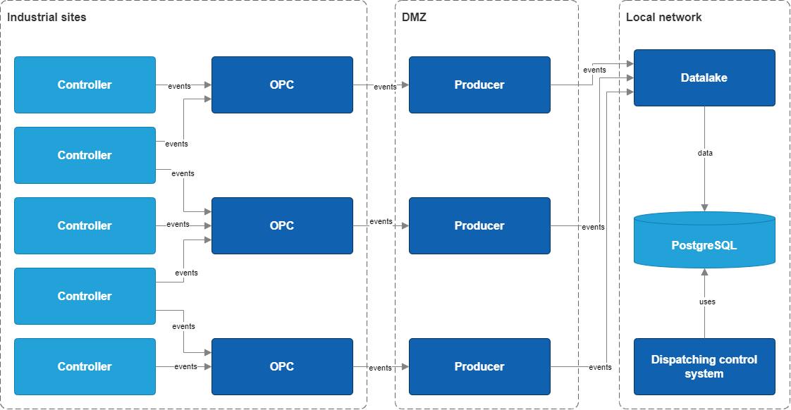

- [Purpose of the document](#purpose-of-the-document)
- [Context](#context)
- [Description of the existing solution](#description-of-the-existing-solution)

# Purpose of the document
This document contains the system design of the IIoT (Industrial Internet of Things) system.
The Document contains descriptions of:
- The overall context of the solution
- Architecture of the existing solution
- Functional requirements
- Non-functional requirements
- Architecture of the solution being developed
- Description of integrations with related systems
- Logging and monitoring
- Software requirements
- Hardware requirements
- Network architecture
- Architecture decision records

# Context
At present, the process of monitoring the situation at the main production sites and information support for decision-making in the field of ensuring optimal equipment condition is carried out by the monitoring service on the basis of information from automated systems in the production facilities on the parameters of equipment and technological processes.
Parameter data from automated systems and other sources are transferred to a centralised database via software data collectors. The main method of equipment condition control is parametric monitoring by two-zone static setpoints based on passport characteristics and expert data. Operational personnel of the situation centre, when receiving alarm messages, act according to the situation, based on their individual experience. The experience of each employee is not digitised and is not transferred from one to another, which brings significant losses in the quality of work to prevent equipment failures, in particular, there is no stability in the quality of work with parameters - it is impossible to predict whether the personnel can cope with the prevention of downtime or not in a particular situation.

# Description of the existing solution
Currently the solution works as follows:
- Producers write the signals required for projects from the Kafka OPC servers to the storage of the consumer systems. The number of signals and consumers is constantly growing. The existing database is already heavily loaded, the accepted SLAs are not met, and there is no unified solution architecture.
- Only the information required for ML projects is transferred to DataLake.
- There is no single place to store the data archive.
- There is no common tag naming rule, tag descriptions are not maintained or are maintained locally at production sites. There is no single directory of all signals available for collection.
- When a new need arises, data collection requests are created. The collection process is not standardised.

